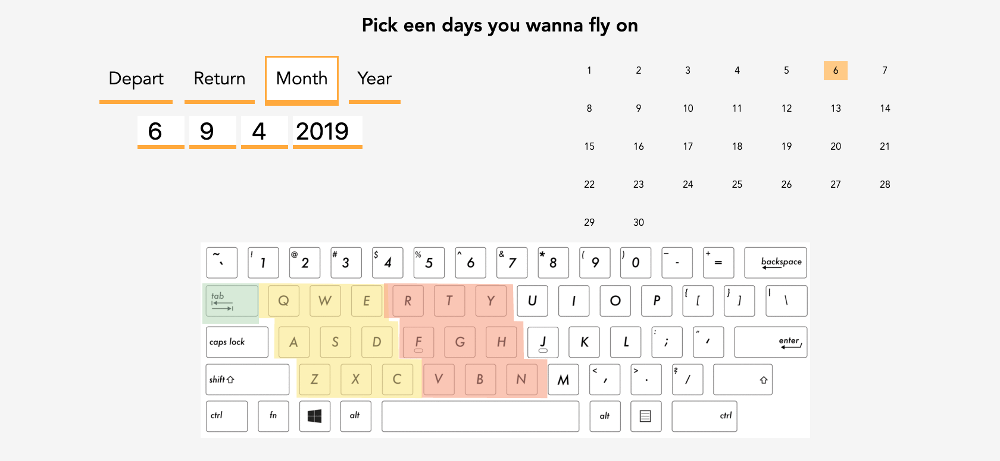
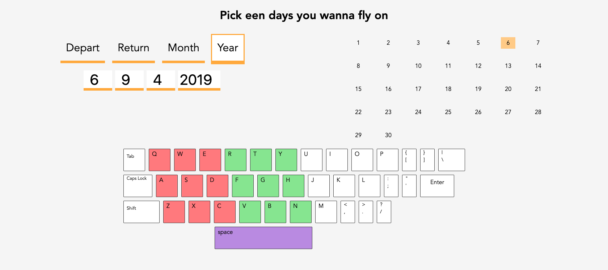
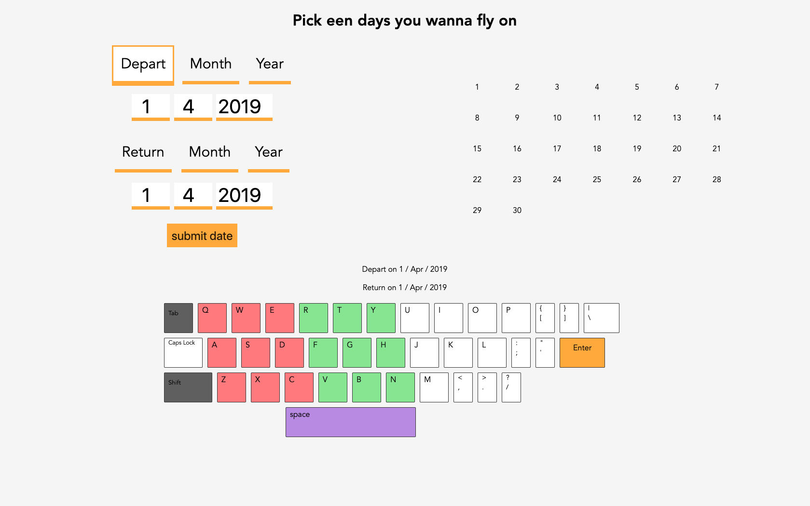

# Web Design
The goal of this project is exclusive design for a physically impaired person, Marijn. Marijn is physically disabled and is confined

#### live @
https://420-vlucht.netlify.com

The interface I'm creating will help Marijn pick a date range using his (only) keyboard. Based on feedback from Marijn I'll make adjustments and test my concept again.

Uses sticky keys
1 handed (avoid lifting hand also not very accurate)
Barely Tabs through sites, he uses the spacebar (and sometimes uses his trackpad)
Wants input to be as simple and short as possible

## Test 1
Tested my App without Marijn because he wasn't present at the first meeting so I received feedback from teachers and classmates.
Feedback I received was that i should give user feedback in the keyboard, instead of my static keyboard showing which keys to press.

   

## Test 2  
Tested my App with Marijn for the first time. He was very pleased but didn't really give any feedback. So after this test I just iterated and adjusted the UI and added more functionality.

   

## Test 3  
Third test Marijn was very late and so I didn't really have an opportunity to apply feedback into final version of app. Over 9000 was not possible. Still I included his feedback in my wishlist.

   

## Exclusive design principles
Study Situation
  To know what to do and how to do it I observed the person I'd be designing for. I watched him test other students' applications and then I watched him test my own to figure out what would be the most suitable for (a user like) him.
Ignore Conventions
  I ignored conventions by assigning events to all the keys. Normally I'd refrain from doing so however because i am designing for for just one user i know how he would use/interact with the app so it was acceptable.
Prioritise Identity
  My App is fitting for a guy like Marijn, it does what it says it does and in a very simple/straightforward way and it looks and behaves that way.
Add Nonsense
  Maybe interesting feedback on user input. so far nothing fun to add though

## Use case scenario
Marijn is een motorisch gehandicapte man die werkt als developer bij (als ik weet waar hij werkt zal ik het hier invullen). Hij werkt met plaktoetsen en verder een gewone laptop (denk ik).

Voor mijn use case is Marijn een vakantie aan het plannen en wil een vlucht boeken. Hij moet nu een vlucht boeken. Boek een vlucht.

## conclusion  
Marijn showed interest in the application and was excited at how simple it was to use. He expressed wishes to make it possible to fill in the date with fewer keys/less input and a more intuitive app.

## Wishes
Make it possible to use numerical keys to fill in the values.
Add more nonsense to make it fun to interact with.
